# Chronicles - System Architecture

> **Note**: This document focuses on architectural decisions (the WHY), not implementation details (the HOW). For implementation steps, see [IMPLEMENTATION.md](IMPLEMENTATION.md).

---

## Table of Contents
1. [Project Overview & Vision](#project-overview--vision)
2. [Core Architecture Decisions](#core-architecture-decisions)
3. [Database Schema Design](#database-schema-design)
4. [UI/UX Architecture](#uiux-architecture)
5. [Security Architecture](#security-architecture)
6. [Data Flow Architecture](#data-flow-architecture)
7. [Technology Stack Rationale](#technology-stack-rationale)
8. [Known Limitations & Trade-offs](#known-limitations--trade-offs)
9. [Folder Structure & Organization](#folder-structure--organization)
10. [Mobile Translation Strategy](#mobile-translation-strategy)
11. [Future Enhancements](#future-enhancements)
12. [Appendices](#appendices)

---

## Project Overview & Vision

### What is Chronicles?

Chronicles is an **encrypted bullet journal application** that enables users to create private, secure journal entries with complete zero-knowledge encryption. The application combines rapid note-taking with comprehensive journaling features, all while ensuring that user data remains completely private and unreadable by the server.

### Core Value Proposition

- **Privacy-First**: Client-side encryption ensures only you can read your entries
- **Speed & Simplicity**: 200-character quick entries for daily note-taking
- **Feature-Rich**: Expandable to poems, medical tracking, task management, and more
- **Zero-Knowledge**: Server cannot decrypt your data, period

### Design Philosophy

1. **Privacy is Non-Negotiable**: Encryption happens client-side before data leaves the browser
2. **Speed Matters**: Quick entries should be instant (type → Enter → saved)
3. **Progressive Enhancement**: Start simple, add features as needed (medical tracking, AI assistance)
4. **User Responsibility**: No password recovery = user must manage their own security

### Key Features Summary

- **Quick Note-Taking**: Fast 200-character entries (expandable for creative writing)
- **Split-Screen View**: Calendar on left, daily entries on right
- **Smart Tasks**: Auto-migrating tasks that move forward until completed
- **Goals Tracking**: Long-term and short-term goals with progress tracking and milestones
- **Medical Tracking**: Medications with scheduling, symptoms, medical history (optional)
- **Flexible Views**: View entries by all/day/week/month/year, filter by topic
- **Contextual UI**: Weather and time display, current day highlighted
- **AI Assistance**: Writing help for expanded entries, smart tagging, insights
- **Zero-Knowledge Encryption**: Client-side encryption, no password recovery
- **Mobile-Ready**: Responsive web app, clear path to React Native mobile app

---

## Core Architecture Decisions

### 1. Multi-Tenant Architecture (Schema-per-User Isolation)

**WHY:** Database-level isolation provides true privacy and simplifies data export/backup per user.

**Decision**: Each user gets their own PostgreSQL schema (WordPress Multisite style).


**Registration Flow:**
```
1. Create user in public.users
2. Generate schemaName using auto-incrementing counter
   - Format: "chronicles_<auto_increment_number>" (e.g., "chronicles_1", "chronicles_2", "chronicles_3")
   - Fetch current max schema number from public.schema_counter table
   - Increment counter atomically (prevents race conditions)
   - Guaranteed unique, no collision possible
   - NOT derived from userId or email (security consideration)
3. Execute: CREATE SCHEMA chronicles_<number>
4. Run migrations on new schema (create all tables)
5. Seed default topics in new schema
6. Store schemaName in users.schemaName field
```

**Query Flow:**
```
1. User authenticates → get userId from session
2. Fetch user.schemaName from public.users
3. Set Prisma schema context to user's schema
4. All queries automatically scoped to user's schema
```

**Trade-offs:**

✅ **Pros:**
- Database-level isolation (stronger security boundary)
- Easier per-user data export (dump entire schema)
- Simpler queries (no userId filters needed)
- Natural multi-tenancy (each user has own namespace)

❌ **Cons:**
- Complex schema migrations (must apply to all user schemas)
- More database connections to manage
- Potential scaling challenges with thousands of schemas
- Requires custom tooling for schema management

**Alternative Considered:** Row-level security with single schema
- Rejected because: Less isolation, more complex queries, harder to export user data atomically

---

### 2. Two-Layer Security Model with Auto-Generated Encryption Key

**WHY:** Separate authentication (server) from encryption (client) to enable zero-knowledge architecture. Use a system-generated encryption key to eliminate password change friction.

**Decision:** Password for authentication only. Auto-generated 256-bit encryption key stored encrypted with password-derived key.


**How It Works:**

1. **Registration:**
   - User provides password
   - Server: bcrypt hash → stores in `passwordHash`
   - Client: Generates random 256-bit master encryption key
   - Client: Derives KEK (Key Encryption Key) from password + salt via PBKDF2
   - Client: Encrypts master key with KEK → `encryptedMasterKey`
   - Server: Stores `encryptedMasterKey` + `salt` (never sees plaintext master key)

2. **Login:**
   - User provides password
   - Server: Validates with bcrypt, returns session token
   - Client: Fetches `encryptedMasterKey` + `salt`
   - Client: Derives KEK from password + salt
   - Client: Decrypts master key, stores in memory
   - Client: Uses master key for all data encryption/decryption

3. **Data Encryption:**
   - All entries encrypted with **master key** (not password-derived key)
   - Master key stays constant unless explicitly rotated
   - Password changes don't require re-encrypting all data

**Key Benefits:**

✅ **Pros:**
- ✅ **Password change is instant** - only re-encrypt the master key (single operation)
- ✅ **No data re-encryption** on password change (huge performance win)
- ✅ **Key rotation on-demand** - user can rotate master key anytime with one click
- ✅ **True zero-knowledge** - server never sees master key or password
- ✅ **Separation of concerns** - authentication ≠ encryption
- ✅ **Better security** - master key is cryptographically random (stronger than password-derived)

❌ **Cons:**
- ❌ Slightly more complex key management (KEK wraps master key)
- ❌ One additional decryption step on login
- ❌ Still no password recovery (by design - zero-knowledge requirement)

**Database Schema Addition:**
```
users table:
- passwordHash (bcrypt)
- encryptedMasterKey (master key encrypted with password-derived KEK)
- salt (for KEK derivation)
```

**Why This is Better Than Password-Derived Encryption:**
- Password change: OLD = re-encrypt ALL entries (could take minutes), NEW = re-encrypt 1 key (instant)
- Key rotation: Can rotate master key independent of password
- Performance: No PBKDF2 on every encryption operation (only once at login)
- Security: Master key is pure randomness (256 bits entropy), not derived from potentially weak password

---

### 3. Client-Side Encryption Strategy

**WHY:** Zero-knowledge architecture ensures server cannot read user data, even if database is compromised.

**Decision:** AES-GCM with PBKDF2 key derivation, 100,000 iterations.


**Encryption Specification:**
```typescript
Algorithm: AES-GCM
Key Size: 256 bits
IV: Random per entry, 12 bytes
Tag Length: 128 bits
Key Derivation: PBKDF2
Hash: SHA-256
Iterations: 100,000
Salt: Unique per user, 32 bytes random
```

**Trade-offs:**

✅ **Pros:**
- True zero-knowledge (server cannot decrypt)
- Web Crypto API (native, secure, fast, no dependencies)
- Random IV per entry prevents pattern analysis
- Industry-standard encryption (AES-GCM)

❌ **Cons:**
- **No password recovery possible** (design constraint)
- Key lost on page refresh (must re-enter password)
- Cannot search encrypted content server-side
- Slower for large datasets (client-side decryption)

**Critical User Impact:** **Password loss = permanent data loss**

**Mitigations:**
- Prominent warnings during registration (red text, checkbox)
- Export functionality for regular backups
- Password change with re-encryption (update before forgetting)

---

### 4. Password Change Strategy (Instant with Master Key)

**WHY:** Users need ability to change passwords without losing access to encrypted data. With master key architecture, this is instant.

**Decision:** Re-encrypt only the master key with new password-derived KEK. No data re-encryption needed.


**What Gets Re-encrypted:**
- ✅ **Only the master key** (single 256-bit value)
- ✅ **NO entry data re-encryption** (master key unchanged)
- ✅ **NO symptoms library re-encryption** (master key unchanged)

**Why This is Superior:**

✅ **Pros:**
- ⚡ **Instant operation** - re-encrypts 1 key, not thousands of entries
- ✅ **No progress bars needed** - completes in milliseconds
- ✅ **No rollback complexity** - single atomic database update
- ✅ **No session timeout issues** - completes instantly
- ✅ **User can change password frequently** - no performance penalty
- ✅ **New salt generated** - fresh KEK derivation each password change

❌ **Cons:**
- None significant (this is strictly better than data re-encryption approach)

**Performance Comparison:**

| Approach | Password Change Time | Risk |
|----------|---------------------|------|
| **Password-Derived Encryption** | Minutes for 10k entries | Timeout, partial failure |
| **Master Key (This)** | < 100ms | None |

---

### 5. Master Key Rotation (One-Click Re-encryption)

**WHY:** Users may want to rotate their encryption key for security (e.g., suspected compromise, compliance, paranoia).

**Decision:** Provide one-click master key rotation that re-encrypts all data with a new random master key.


**When to Rotate:**
- Suspected key compromise
- Compliance requirements (e.g., annual rotation)
- After employee with database access leaves
- User paranoia (totally valid!)

**What Gets Re-encrypted:**
- ✅ All `entries.encryptedContent` (all journal data)
- ✅ All `symptoms_library.encryptedName` and `encryptedDescription`
- ✅ Uploaded files (if applicable)
- ✅ Master key (encrypted with KEK - same password, new master key)

**Performance:**
- Same as old password change approach
- Batch processing for large datasets
- Progress indicator (shows % complete)
- Time-intensive: Could take **minutes** for thousands of entries
- **But password change is still instant!** (different operation)

**UI/UX:**
```typescript
<RotateKeyButton>
  <WarningDialog>
    ⚠️ Rotate Encryption Key

    This will:
    - Generate a new random encryption key
    - Re-encrypt ALL your data with the new key
    - Take several minutes for large datasets
    - Require you to stay on this page until complete

    Your password stays the same.

    [Enter Password to Confirm] [Cancel] [Rotate Key]
  </WarningDialog>
</RotateKeyButton>
```

**Benefits:**
- ✅ Independent of password changes
- ✅ Cryptographic refresh (new random key)
- ✅ Defense in depth (limit key lifetime)
- ✅ User control (explicit action)

---

### 6. Data Export Functionality

**WHY:** Users need ability to backup their data and comply with data portability regulations (GDPR).

**Decision:** Client-side export that decrypts all data before exporting to various formats.


**Export Formats:**

1. **JSON** (Complete Backup - Recommended)
   ```json
   {
     "exportDate": "2025-01-15T10:30:00Z",
     "entries": [
       {
         "id": "entry_123",
         "content": "Decrypted content here",
         "topic": "idea",
         "date": "2025-01-15",
         "metadata": { "isCompleted": false }
       }
     ],
     "topics": [...],
     "symptomsLibrary": [...],
     "relationships": [...]
   }
   ```

2. **CSV** (Spreadsheet Import)
   - Separate CSV files for entries, topics, symptoms
   - Flattened structure for Excel/Google Sheets

3. **Markdown** (Human-Readable)
   ```markdown
   # Chronicles Export - 2025-01-15

   ## January 15, 2025

   ### Tasks
   - [ ] Complete project proposal

   ### Ideas
   - New app concept: encrypted journaling
   ```

4. **PDF** (Printable Archive)
   - Styled, formatted document
   - Organized by date and topic
   - Suitable for sharing with healthcare providers

**Implementation Notes:**
- All decryption happens client-side (zero-knowledge maintained)
- Large exports may take time (show progress bar)
- Export includes ALL user data from their schema
- No server-side plaintext exposure

**API Endpoints:**
- `GET /api/export/all` - Returns all encrypted data from user's schema
- `GET /api/export/entries?dateRange=...` - Filtered export
- `GET /api/export/topics` - Export topic configuration

---

### 6. Account Deletion & Schema Cleanup

**WHY:** Users have right to delete their data (GDPR compliance) and free up database resources.

**Decision:** Complete schema deletion with cascade to remove all user data.

```mermaid
sequenceDiagram
    participant U as User
    participant C as Client
    participant API as API
    participant DB as Database

    U->>C: Settings → Delete Account
    C->>U: Show warning dialog<br/>"This is PERMANENT and IRREVERSIBLE"

    U->>C: Type email to confirm + password
    C->>API: POST /api/user/delete<br/>{email, password}

    API->>DB: Verify credentials
    DB-->>API: User authenticated ✓

    API->>DB: Fetch user.schemaName<br/>(e.g., "chronicles_42")
    DB-->>API: schemaName

    rect rgb(255, 230, 230)
    Note over API,DB: Complete Data Deletion
    API->>DB: DROP SCHEMA chronicles_42 CASCADE
    Note over DB: Deletes ALL tables in schema:<br/>- entries<br/>- topics<br/>- symptoms_library<br/>- entry_relationships<br/>- user_settings<br/>- shared_entries

    DB-->>API: Schema dropped ✓

    API->>DB: DELETE FROM public.users<br/>WHERE id = userId
    DB-->>API: User deleted ✓
    end

    API-->>C: Account deleted ✓
    C->>C: Clear session, encryption key
    C->>U: Redirect to homepage<br/>"Your account and all data have been permanently deleted"
```



**Deletion Flow Requirements:**

1. **User Confirmation**
   - Must type their email address exactly
   - Must provide current password (verify they own the account)
   - Checkbox: "I understand this is permanent and all my data will be lost"

2. **Pre-Deletion Export Prompt**
   ```
   ⚠️ Before deleting your account, would you like to export your data?

   [Export All Data] [Skip and Delete]
   ```

3. **Atomic Deletion**
   - Transaction wraps both schema drop and user deletion
   - If schema drop fails → rollback, don't delete user record
   - If user deletion fails → rollback (but schema already gone)

4. **What Gets Deleted**
   - User's entire PostgreSQL schema (`chronicles_<number>`)
   - All tables within: entries, topics, symptoms_library, etc.
   - User record from `public.users` table
   - Session tokens (force logout)
   - Shared entry tokens (makes shared links invalid)

5. **What Does NOT Get Deleted**
   - Schema counter (maintains sequence for future users)
   - Application logs (anonymized, no PII)
   - Analytics data (if anonymized)

**Security Considerations:**
- ✅ Password required (prevents accidental/unauthorized deletion)
- ✅ Email confirmation (prevents typo-induced deletion)
- ✅ Cascade drop (no orphaned data)
- ✅ Session invalidation (immediate logout)
- ⚠️ Irreversible operation (cannot be undone)

**Database Impact:**
```sql
-- Example deletion for user with schemaName="chronicles_42"

BEGIN TRANSACTION;

-- Step 1: Drop user's entire schema (includes all tables)
DROP SCHEMA IF EXISTS chronicles_42 CASCADE;

-- Step 2: Remove user from public.users
DELETE FROM public.users WHERE id = 'user_abc123';

COMMIT;
```

**UI/UX Requirements:**

```typescript
<DeleteAccountDialog>
  <WarningHeader color="red">
    ⚠️ PERMANENT ACCOUNT DELETION ⚠️
  </WarningHeader>

  <WarningText>
    This action will permanently delete:
    - All your journal entries
    - All your tasks, goals, and milestones
    - All medical data (medications, symptoms)
    - All topics and settings
    - Your account login

    This CANNOT be undone. No recovery is possible.
  </WarningText>

  <ExportPrompt>
    💾 Recommended: Export your data first
    <ExportButton>Export All Data</ExportButton>
  </ExportPrompt>

  <ConfirmationInputs>
    <Input
      label="Type your email to confirm"
      validate={email === user.email}
    />
    <Input
      label="Enter your password"
      type="password"
    />
    <Checkbox required>
      I understand this is permanent and irreversible
    </Checkbox>
  </ConfirmationInputs>

  <ButtonGroup>
    <CancelButton>Cancel</CancelButton>
    <DeleteButton
      disabled={!allConfirmed}
      color="red"
    >
      Permanently Delete My Account
    </DeleteButton>
  </ButtonGroup>
</DeleteAccountDialog>
```

**API Endpoint:**
```typescript
POST /api/user/delete
{
  email: string,      // Must match user.email
  password: string    // Must be correct
}

Response:
{
  success: true,
  message: "Account and all data permanently deleted"
}
```

---

### 7. Unified Data Model with Special Topics

**WHY:** Avoid data fragmentation and simplify encryption/queries by using a single `entries` table for all content types.

**Decision:** Instead of separate tables for goals, medications, tasks, etc., use one `entries` table where the `topicId` determines special functionality.

#### Traditional Approach (❌ Rejected)

```
Separate tables for each feature:
├── journal_entries (id, encryptedContent, iv, topicId...)
├── tasks (id, encryptedContent, iv, isCompleted, isAutoMigrating...)
├── goals (id, encryptedTitle, encryptedDescription, iv, progressPercentage...)
├── milestones (id, goalId, encryptedTitle, iv, isCompleted...)
├── medications (id, encryptedName, iv, schedule, scheduledTime...)
├── symptoms (id, encryptedName, iv, severity...)
├── doctors (id, encryptedName, iv...)
├── hospitals (id, encryptedName, iv...)
```

**Problems:**
- 🔴 Data scattered across 8+ tables
- 🔴 Complex UNION queries to show all entries for a day
- 🔴 Password change must iterate 8+ tables
- 🔴 Adding new features requires new tables and migrations
- 🔴 Redundant fields repeated in every table
- 🔴 Export requires merging multiple table dumps

#### Special Topics Approach (✅ Chosen)

```
Unified architecture:
├── entries (ALL content with conditional special fields)
│   ├── Standard fields: id, encryptedContent, iv, topicId, entryDate
│   ├── Task fields: isCompleted, isAutoMigrating
│   ├── Goal fields: progressPercentage, goalStatus, targetDate
│   ├── Medication fields: schedule, scheduledTime, takenTime, medicationStatus
│   └── Symptom fields: symptomId, severity
├── topics (defines which special features each topic unlocks)
│   ├── name, color, icon
│   ├── specialType: "task" | "goal" | "medication" | etc.
│   └── isEnabled: can be toggled in settings
├── entry_relationships (links entries together)
└── symptoms_library (reusable symptom definitions)
```

**WordPress Analogy - This Makes Sense:**

Chronicles' architecture is similar to WordPress's flexible content model:

| **Chronicles** | **WordPress Equivalent** | **Purpose** |
|---------------|-------------------------|-------------|
| `entries` table | `wp_posts` table | Core content container for everything |
| `topics` table | `wp_terms` (categories/tags) | Content categorization |
| `topicId` field | `term_id` relationship | Links entry to its category |
| Special fields (isCompleted, severity, etc.) | `wp_postmeta` table | Entry-specific metadata |
| `specialType` (task, goal, med) | Custom post types | Defines special behavior per category |
| `entry_relationships` | `wp_term_relationships` | Links related entries together |

**Just like WordPress**:
- WordPress stores blog posts, pages, media, and custom post types **all in `wp_posts`**
- Chronicles stores journal entries, tasks, goals, medications **all in `entries`**
- The "type" field determines what fields and UI are available
- Additional metadata provides type-specific functionality

**Better than WordPress**:
- ✅ **Flatter structure**: Special fields are table columns, not separate meta table (faster queries)
- ✅ **Encrypted content**: All sensitive data encrypted client-side
- ✅ **Type-safe fields**: Special fields validated at API layer based on topic type
- ✅ **No JOINs for metadata**: Everything in one row (better performance)

**Benefits:**
- ✅ Single source of truth for all content
- ✅ Simple queries: `SELECT * FROM entries WHERE entryDate = ?`
- ✅ Fast re-encryption: one table to iterate
- ✅ Extensible: new special types need no schema changes
- ✅ Flexible: entries can be re-categorized by changing topic
- ✅ DRY: shared fields defined once

#### How It Works

**1. Topics Define Special Behavior:**
```typescript
// Regular topic
{ id: "topic_idea", name: "idea", specialType: null, isSpecial: false }

// Special topic
{ id: "topic_task", name: "task", specialType: "task", isSpecial: true }
{ id: "topic_goal", name: "goal", specialType: "goal", isSpecial: true }
```

**2. Entries Activate Special Fields Based on Topic:**
```typescript
// Regular entry - only uses standard fields
{
  topicId: "topic_idea",
  encryptedContent: "...",
  iv: "...",
  entryDate: "2025-01-15"
  // Special fields are NULL
}

// Task entry - uses task-specific fields
{
  topicId: "topic_task",
  encryptedContent: "...",
  iv: "...",
  entryDate: "2025-01-15",
  isCompleted: false,
  isAutoMigrating: true
  // Other special fields are NULL
}

// Goal entry - uses goal-specific fields
{
  topicId: "topic_goal",
  encryptedContent: "...",
  iv: "...",
  entryDate: "2025-01-15",
  progressPercentage: 66,
  goalStatus: "in_progress",
  targetDate: "2025-12-31"
  // Other special fields are NULL
}
```

**3. UI Checks Topic Type to Render Appropriate Controls:**
```typescript
// Pseudo-code for rendering an entry
function renderEntry(entry) {
  // Get topic information
  const topic = getTopicById(entry.topicId);

  // Decrypt content
  const content = decrypt(entry.encryptedContent, entry.iv);

  // Render based on special type
  if (topic.specialType === "task") {
    return <TaskEntry content={content} isCompleted={entry.isCompleted} />;
  } else if (topic.specialType === "goal") {
    return <GoalEntry content={content} progress={entry.progressPercentage} />;
  } else {
    return <RegularEntry content={content} />;
  }
}
```

#### Progressive Feature Disclosure

**Settings Control Topic Visibility:**
```typescript
// Medical topics disabled by default
settings.medicalTopicsEnabled = false;
topics.where({ specialType: ['medication', 'symptom', 'doctor', 'hospital'] })
      .update({ isEnabled: false });

// User enables medical tracking
settings.medicalTopicsEnabled = true;
topics.where({ specialType: ['medication', 'symptom', 'doctor', 'hospital'] })
      .update({ isEnabled: true });
// → Medical topics now appear in topic selector
```

**Trade-offs:**

✅ **Pros:**
- Simpler codebase (one CRUD pattern for all content)
- Faster queries (no JOINs across feature tables)
- Easier testing (one data model to test)
- Natural extensibility (add special types without migrations)
- Better export/import (single table format)

❌ **Cons:**
- Nullable fields in entries table (but only ~10 special fields total)
- Must check topic type to validate which fields are valid
- Slightly more complex field validation logic

**Why Cons are Acceptable:**
- Modern databases handle sparse columns efficiently
- Type checking is done once at API layer, not repeated everywhere
- 10 nullable fields < complexity of 8 separate tables

---

### 8. Critical User Constraint

⚠️ **No Password Recovery Possible**

This is a **fundamental architectural constraint**, not a missing feature.

**WHY:**
- Master encryption key is encrypted with password-derived KEK
- Server never has access to plaintext master key or password
- No "reset password" email can work (cannot decrypt master key without password)

**User Impact:**
- Password forgotten = **all data permanently lost**
- No customer support can recover data
- No "security questions" or backup methods

**Mitigations:**
1. **Prominent Warnings**: Red text, checkbox during registration
2. **Export Functionality**: Download all decrypted data as JSON backup
3. **Password Change**: Re-encrypt before forgetting (if they remember old password)

**UX Copy:**
```
⚠️ CRITICAL WARNING ⚠️

There is NO PASSWORD RECOVERY. If you forget your password,
all your data will be PERMANENTLY LOST. No one can recover it,
not even our support team.

✓ I understand and accept this risk
```

---

## Database Schema Design

### Schema Overview

**WHY:** Separate global authentication from isolated user data.


### Encryption Strategy with Special Topics Architecture

**Key Principle**: With the unified `entries` table, all private content goes into `encryptedContent`, making encryption consistent and simple.

**Encrypted Fields** (privacy-sensitive):
- `entries.encryptedContent` + `iv` - **All user content** (journal entries, goals, medications, symptoms, etc.)
- `symptoms_library.encryptedName` + `encryptedDescription` + `iv` - Reusable symptom definitions

**NOT Encrypted** (needed for queries and filtering):
- Entry metadata: `topicId`, `entryDate`, `isCompleted`, `isAutoMigrating`
- Topic data: `name`, `color`, `icon`, `specialType`, `isEnabled`
- Goal metadata: `progressPercentage`, `goalStatus`, `targetDate`
- Medication metadata: `schedule`, `scheduledTime`, `takenTime`, `medicationStatus`
- Symptom metadata: `symptomId`, `severity`
- Relationships: `entryId`, `relatedToId`, `relationshipType`

**WHY This is Better:**
- ✅ **Consistent encryption**: Everything private goes through the same encrypt/decrypt pipeline
- ✅ **Simpler re-encryption**: Password change only needs to iterate `entries` + `symptoms_library`
- ✅ **No field-level encryption complexity**: Don't need separate encryption for title vs description vs notes
- ✅ **Unified content model**: All topics store their content in the same field

**What the Server Knows (Metadata Only):**
- "User has 5 entries on 2025-01-15"
- "One entry is a task, one is a goal, three are regular notes"
- "The task is incomplete and set to auto-migrate"
- "The goal has 3 linked milestones and is 66% complete"
- "User takes a medication daily at 8am and 8pm"

**What the Server CANNOT Know (Encrypted):**
- What the task says
- What the goal is about
- What medication the user takes
- Any actual journal content

**Trade-off Acceptance:**
- Metadata enables essential features (filtering, auto-migration, progress tracking)
- Sensitive information (what/who/why) remains encrypted
- Acceptable balance between privacy and functionality

---

## UI/UX Architecture

### Split-Screen Interface Design

**WHY:** Provide calendar context while enabling rapid entry creation in one view.


**Design Decisions:**

- **40/60 Split**: Calendar provides context, entries are primary focus
- **Mobile**: Stack vertically (calendar top, entries bottom)
- **Quick Entry at Top**: Minimal friction for daily journaling
- **Immediate Save on Enter**: No save button needed (speed matters)
- **Calendar Selection Syncs**: Clicking date filters entries automatically

---

### Entry Types & Modes


**WHY Different Modes:**
- **Quick Entry**: 90% of journaling is brief notes (speed matters most)
- **Expanded Writing**: Poems, reflections need rich text (quality matters)
- **Voice Entry**: Hands-free for accessibility or convenience
- Separate modes prevent UI clutter for common case

**Data Structure (Before Encryption):**
```typescript
{
  content: string; // Plain text OR Tiptap JSON
  isExpandedWriting: boolean; // false = 200 char, true = unlimited
  // For tasks only:
  isCompleted?: boolean;
  isAutoMigrating?: boolean;
}
```

---

### Task-Specific UI

**WHY:** Tasks need completion tracking + auto-migration controls beyond normal entries.

**Conditional Rendering:**
```typescript
// Only for entries where topicId === "task"
if (entry.topic.name === "task") {
  show: TaskCheckbox (mark completed)
  show: AutoMigrateToggle (enable/disable migration)
}
```

**Visual Indicators:**
- **Completed tasks**: Strikethrough text, gray color, checkbox checked
- **Auto-migrating tasks**: Badge/icon indicator (↻ symbol)
- **Migrated tasks today**: Subtitle "Migrated from [date]"

**Special Behavior:**
- "Task" topic **cannot be deleted** (system enforces in DELETE endpoint)
- Auto-migrating tasks appear on current day if incomplete
- Completed tasks stay on original date (historical record)

---

### Application Navigation Structure

**WHY:** Provide clear access paths to specialized views while maintaining the simplicity of the split-screen journal interface.


**Access Patterns:**
- **Primary View**: Split-screen journal (calendar + daily entries)
- **Secondary Views**: Accessed via hamburger menu
- **Modal Overlays**: Settings, edit dialogs, expanded writing
- **Persistent Navigation**: Hamburger menu always accessible

---

### Specialized Views Architecture

**WHY:** Different types of data require different visualization and interaction patterns. The unified entries table enables flexible views over the same underlying data.

**Core Philosophy - Entry-First Approach:**

Chronicles does NOT have separate CRUD interfaces for medications, symptoms, etc. Instead:
1. **Everything is an entry**: Medications, symptoms, food are all journal entries with topic-specific fields
2. **Create via journal**: Users type entries in their daily journal (same as tasks or notes)
3. **Views for analysis**: Specialized views query these entries and provide analytics/visualizations

**Example Flow**:
```typescript
// User workflow:
// 1. User creates entry in journal: "Tylenol" with topic=medication
//    → Entry created with medicationStatus="taken", takenTime=now()

// 2. User navigates to Medications Compliance View
//    → View queries: SELECT * FROM entries WHERE topicId='topic_medication'
//    → Displays adherence chart, compliance stats from those entries

// 3. User clicks on a day in the view
//    → Shows that day's medication entries
//    → Can edit entry status inline (taken → missed)
```

**Benefits of Entry-First**:
- ✅ Consistent UX: everything created the same way
- ✅ No context switching: log meds while journaling about your day
- ✅ Natural chronology: entries are date-based by default
- ✅ Unified search: find medications alongside notes about how you felt
- ✅ Simpler codebase: one entry creation flow, multiple analytics views

#### 1. Goals Management View (`/goals`)

**Purpose**: Centralized goal tracking with milestone management

**Components**:
```typescript
<GoalsView>
  <GoalsFilterBar>
    - Status filter: All | Not Started | In Progress | Completed | Archived
    - Sort by: Progress | Target Date | Created Date
    - Create New Goal button
  </GoalsFilterBar>

  <GoalsList>
    {goals.map(goal => (
      <GoalCard key={goal.id}>
        <GoalHeader>
          - Title (decrypted)
          - Progress bar (auto-calculated from milestones)
          - Target date + days remaining
          - Status badge
        </GoalHeader>

        <GoalActions>
          - Edit goal (inline or modal)
          - Archive goal
          - Abandon goal
          - Delete goal (if no milestones)
        </GoalActions>

        <MilestonesList expandable>
          {milestones.map(milestone => (
            <MilestoneItem>
              - Checkbox (completion toggle)
              - Title (decrypted)
              - Completion date (if completed)
              - Edit/Delete actions
              - Drag handle (reorder)
            </MilestoneItem>
          ))}
          <AddMilestoneButton />
        </MilestonesList>
      </GoalCard>
    ))}
  </GoalsList>
</GoalsView>
```

**Data Flow**:
1. Fetch all entries where `topicId = "topic_goal"`
2. For each goal, fetch linked milestones via `entry_relationships` table
3. Calculate progress: `(completed milestones / total milestones) * 100`
4. When milestone toggled → update entry → recalculate goal progress
5. All edits encrypt before saving

---

#### 2. Symptoms Analytics View (`/medical/symptoms`)

**Purpose**: Pattern detection and symptom tracking

**Data Model**: Symptoms are created as journal entries with `topicId = "topic_symptom"`. Each symptom entry has:
- `encryptedContent`: Symptom description
- `symptomId`: Reference to `symptoms_library` for autocomplete
- `severity`: 1-10 scale
- `entryDate`: When symptom occurred

**Components**:
```typescript
<SymptomsAnalyticsView>
  <AnalyticsHeader>
    <DateRangePicker>
      - Presets: Today | Last 7 Days | Last 30 Days | Custom
    </DateRangePicker>
    <SymptomFilter>
      - Multi-select from symptoms_library
    </SymptomFilter>
    <SeverityFilter>
      - Range slider: 1-10
    </SeverityFilter>
  </AnalyticsHeader>

  <AnalyticsTabs>
    <Tab name="Overview">
      <SymptomFrequencyBarChart />  // Bar chart: most frequent symptoms for selected time
      <SymptomDistributionPieChart /> // Pie chart: symptom percentage breakdown
      <AverageSeverityChart />      // Line chart: symptom → avg severity over time
      <SymptomsByDayOfWeek />       // Heatmap: day of week patterns
    </Tab>

    <Tab name="Timeline">
      <SymptomCalendar>
        // Calendar view with symptom dots on dates
        // Hover shows severity
        // Click date → Day Detail Modal
      </SymptomCalendar>
    </Tab>

    <Tab name="Details">
      <SymptomDetailTable>
        // Sortable table: Date | Symptom | Severity | Associated Data
        // "Associated Data" shows meds, food, events from same day
      </SymptomDetailTable>
    </Tab>
  </AnalyticsTabs>
</SymptomsAnalyticsView>
```

**Query Strategy**:
```sql
-- Get symptoms with associated context
SELECT
  s.id, s.encryptedContent, s.iv, s.severity, s.entryDate, s.symptomId,
  sl.encryptedName as symptom_name,
  -- Associated medications (same day)
  (SELECT json_agg(m.*)
   FROM entries m
   WHERE m.topicId = 'topic_medication'
   AND DATE(m.entryDate) = DATE(s.entryDate)) as same_day_medications,
  -- Associated food (same day)
  (SELECT json_agg(f.*)
   FROM entries f
   WHERE f.topicId = 'topic_food'
   AND DATE(f.entryDate) = DATE(s.entryDate)) as same_day_food
FROM entries s
LEFT JOIN symptoms_library sl ON s.symptomId = sl.id
WHERE s.topicId = 'topic_symptom'
AND s.entryDate BETWEEN ? AND ?
ORDER BY s.entryDate DESC;
```

---

#### 3. Medications Analytics & Compliance View (`/medical/medications`)

**Purpose**: Medication adherence tracking and compliance analytics

**Data Model**: Medications are created as journal entries with `topicId = "topic_medication"`. Each medication entry has:
- `encryptedContent`: Medication name (encrypted)
- `medicationStatus`: "taken" | "missed" | "skipped"
- `scheduledTime`: When medication should be taken
- `takenTime`: When medication was actually taken (if status = taken)
- `schedule`: JSON with recurring schedule info (daily, weekly, etc.)

**Key Insight**: Users create medication entries (just like any other journal entry). This view analyzes and visualizes those entries for compliance tracking.

**3a. Compliance Charts & Analytics**
```typescript
<MedicationComplianceView>
  <DateRangePicker>
    - Last 7 days | Last 30 days | Last 90 days | Custom
  </DateRangePicker>

  <ComplianceCharts>
    <AdherenceLineChart>
      // Line chart showing adherence % over time
      // X-axis: dates, Y-axis: % of doses taken on time
    </AdherenceLineChart>

    <AdherenceByMedicationBarChart>
      // Bar chart showing adherence rate per medication
      // Helps identify which medications are missed most often
    </AdherenceByMedicationBarChart>

    <CalendarHeatmap>
      // Calendar view with color-coded adherence
      // Green = all doses taken
      // Yellow = some doses skipped
      // Red = missed doses
      // Gray = no doses scheduled
    </CalendarHeatmap>
  </ComplianceCharts>

  <StatisticsPanel>
    - Overall adherence rate: X%
    - Streak: X consecutive days with 100% adherence
    - Most missed medication
    - Best/worst adherence times
  </StatisticsPanel>
</MedicationComplianceView>
```

**3b. Medication Schedule Views**
```typescript
// Day View - shows medication entries for selected day
<MedicationDayView date={selectedDate}>
  <TimeSlotsList>
    // Group medication entries by scheduledTime
    {timeSlots.map(time => (
      <TimeSlot time={time}>
        {entriesAtTime.map(entry => (
          <MedicationEntry>
            - Name (decrypt entry.encryptedContent)
            - Status badge: entry.medicationStatus (taken/missed/skipped)
            - Scheduled: entry.scheduledTime
            - Taken: entry.takenTime (if status = taken)
            - Edit entry inline (change status, update taken time)
          </MedicationEntry>
        ))}
      </TimeSlot>
    ))}
  </TimeSlotsList>
</MedicationDayView>

// Week View - grid showing all medication entries for 7 days
<MedicationWeekView week={selectedWeek}>
  <WeekGrid>
    {days.map(day => (
      <DayColumn day={day}>
        {uniqueMedications.map(medName => {
          const entry = getEntryForDayAndMed(day, medName);
          return (
            <StatusCell>
              // ✓ = taken, ⊗ = missed, ⊘ = skipped
              // Click to view/edit entry
            </StatusCell>
          );
        })}
      </DayColumn>
    ))}
  </WeekGrid>
  <WeekStats>
    - Adherence rate: X%
    - Doses taken: X/Y
  </WeekStats>
</MedicationWeekView>

// Month View - condensed calendar showing daily totals
<MedicationMonthView month={selectedMonth}>
  <MonthCalendar>
    {days.map(day => {
      const entries = getMedicationEntriesForDay(day);
      const taken = entries.filter(e => e.medicationStatus === 'taken').length;
      const missed = entries.filter(e => e.medicationStatus === 'missed').length;
      const skipped = entries.filter(e => e.medicationStatus === 'skipped').length;

      return (
        <DayCell>
          <DaySummary>
            {taken > 0 && <TakenBadge>{taken} ✓</TakenBadge>}
            {missed > 0 && <MissedBadge>{missed} ⊗</MissedBadge>}
            {skipped > 0 && <SkippedBadge>{skipped} ⊘</SkippedBadge>}
          </DaySummary>
        </DayCell>
      );
    })}
  </MonthCalendar>
</MedicationMonthView>
```

**Note**: All views work with medication **entries** from the unified `entries` table. No separate medication database - just entries with `topicId = "topic_medication"` and special fields populated.

---

#### 4. Correlation View (`/medical/correlations`)

**Purpose**: Identify relationships between symptoms, medications, food, and events

**Components**:
```typescript
<CorrelationView>
  <FilterPanel>
    <SymptomSelector multiple />
    <MedicationSelector multiple />
    <DateRangePicker />
    <TopicFilters>
      - Include food entries
      - Include events
      - Include tasks
    </TopicFilters>
  </FilterPanel>

  <VisualizationTabs>
    <Tab name="Timeline">
      <CorrelationTimeline>
        // Horizontal timeline with swim lanes:
        // Lane 1: Symptoms (color by severity)
        // Lane 2: Medications (color by taken/missed)
        // Lane 3: Food entries
        // Lane 4: Events
        // Click any entry → expand details
      </CorrelationTimeline>
    </Tab>

    <Tab name="Day Detail">
      <DayDetailView date={selectedDate}>
        <SymptomsSection>
          {symptoms.map(s => (
            <SymptomEntry severity={s.severity} name={decrypt(s)} />
          ))}
        </SymptomsSection>

        <MedicationsSection>
          {medications.map(m => (
            <MedicationEntry status={m.status} name={decrypt(m)} time={m.takenTime} />
          ))}
        </MedicationsSection>

        <FoodSection>
          {food.map(f => (
            <FoodEntry content={decrypt(f)} />
          ))}
        </FoodSection>

        <OtherEntriesSection>
          {otherEntries.map(e => (
            <Entry topic={e.topic} content={decrypt(e)} />
          ))}
        </OtherEntriesSection>
      </DayDetailView>
    </Tab>

    <Tab name="Patterns">
      <PatternAnalysis>
        // "Symptom X occurred on 8/10 days when Medication Y was missed"
        // "High severity symptoms correlate with Food Z intake"
        // Statistical analysis (client-side on decrypted data)
      </PatternAnalysis>
    </Tab>
  </VisualizationTabs>
</CorrelationView>
```

---

#### 5. Food Diary View (`/medical/food`)

**Purpose**: Track dietary intake and identify food-related patterns

**Components**:
```typescript
<FoodDiaryView>
  <FilterBar>
    <DateRangePicker />
    <SearchBox placeholder="Search food items..." />
    <MealTypeFilter>
      - All | Breakfast | Lunch | Dinner | Snack
    </MealTypeFilter>
  </FilterBar>

  <FoodEntriesList>
    {groupedByDate(foodEntries).map(group => (
      <DateGroup date={group.date}>
        <DateHeader>{formatDate(group.date)}</DateHeader>
        {group.entries.map(entry => (
          <FoodEntry>
            - Content (decrypted)
            - Time
            - Edit/Delete actions
            - View symptoms that day (link to Correlation View)
          </FoodEntry>
        ))}
      </DateGroup>
    ))}
  </FoodEntriesList>

  <ExportButton>
    // Export as PDF/CSV for healthcare providers
  </ExportButton>
</FoodDiaryView>
```

---

#### 6. Journal Usage Guide View (`/guide`)

**Purpose**: Educational content to help users maximize journaling effectiveness

**Structure**:
```typescript
<GuideView>
  <GuideSidebar>
    <NavSection name="Getting Started">
      - What is Chronicles?
      - Your first journal entry
      - Understanding topics
      - Quick vs expanded entries
    </NavSection>

    <NavSection name="Core Features">
      - Task auto-migration
      - Using the calendar
      - View modes explained
      - Search and filters
    </NavSection>

    <NavSection name="Goals Tracking">
      - Setting SMART goals
      - Creating milestones
      - Tracking progress
      - When to archive vs abandon
    </NavSection>

    <NavSection name="Medical Tracking">
      - Enabling medical features
      - Setting up medications
      - Logging symptoms effectively
      - Using the correlation view
      - Food diary best practices
    </NavSection>

    <NavSection name="Privacy & Security">
      - How encryption works
      - Password best practices
      - Export your data
      - No password recovery (important!)
    </NavSection>

    <NavSection name="Quick Reference">
      - Keyboard shortcuts
      - Topic icons guide
      - View modes comparison
    </NavSection>
  </GuideSidebar>

  <GuideContent>
    {selectedSection.content}
    // Rich content with images, videos, interactive examples
  </GuideContent>
</GuideView>
```

**Content Format** (Markdown + Components):
```markdown
## How to Log Symptoms Effectively

Consistent symptom tracking helps you identify patterns and triggers.

### Best Practices:
1. **Log immediately** - Don't wait until end of day
2. **Be specific** - "Headache" vs "Throbbing headache, right temple"
3. **Rate severity honestly** - Use full 1-10 scale
4. **Add context** - What were you doing? What did you eat?

### Using the Symptoms Library:
- First time: Type symptom name → saved to library
- Next time: Autocomplete from library
- Consistent naming helps with analytics

<TipBox>
💡 **Pro Tip**: Use the Correlation View weekly to spot patterns between symptoms, medications, and food.
</TipBox>
```

---

## Security Architecture

### Registration & Login Flow


**Security Properties:**
1. Password hashed with bcrypt server-side (10 rounds)
2. Salt retrieved **after** authentication (prevents enumeration)
3. Encryption key derived client-side (never sent to server)
4. Password cleared from memory immediately after key derivation
5. Session token stored in httpOnly cookie (prevents XSS theft)

---

### Entry Encryption/Decryption Flow


**Security Properties:**
1. Plain text **never sent to server**
2. Each entry has unique IV (prevents pattern analysis)
3. Server stores opaque encrypted blobs
4. Decryption happens in browser memory
5. Decrypted text never persisted (only in component state)

---

### Entry Sharing Security Model

**WHY:** Allow sharing without compromising zero-knowledge architecture.


**Share URL Format:**
```
https://app.com/share/{shareToken}#{base64(encryptionKey)}
                         ↑                ↑
                      Server            Client
                     (can see)       (never sent)
```

**Security Properties:**
1. ✅ Encryption key in URL fragment (never sent to server in HTTP request)
2. ✅ Server only has encrypted data + metadata (cannot decrypt)
3. ✅ Optional expiration time (share link stops working after expiry)
4. ✅ Revocable by owner (deletes share record, link becomes invalid)
5. ❌ **Anyone with full URL can decrypt** (treat like password)

**Trade-offs:**
- **Pro**: True zero-knowledge sharing (server cannot read shared content)
- **Con**: URL must be transmitted securely (if intercepted, data readable)
- **Acceptable**: Similar to "share via password" pattern, user responsibility

---

### Page Refresh Key Recovery

**WHY:** Encryption key stored in memory is lost on page refresh, but session remains valid.

```mermaid
sequenceDiagram
    participant U as User
    participant B as Browser
    participant S as Server

    rect rgb(230, 255, 230)
    Note over U,S: Initial Login
    U->>B: Enter password
    B->>S: Authenticate
    S-->>B: Session token ✓
    B->>S: GET /api/user/salt
    S-->>B: Salt
    B->>B: Derive key in memory
    Note over B: Key stored in memory only
    end

    rect rgb(255, 230, 230)
    Note over U,S: Page Refresh
    B->>B: Page reload
    B->>B: Memory cleared!<br/>Key lost!
    B->>S: Check session
    S-->>B: Session valid ✓
    B->>B: But no encryption key!
    B->>U: Show modal:<br/>"Re-enter password to decrypt"
    end

    rect rgb(230, 230, 255)
    Note over U,S: Key Re-derivation
    U->>B: Enter password
    B->>S: GET /api/user/salt
    S-->>B: Salt
    B->>B: Re-derive key<br/>PBKDF2(password + salt)
    B->>B: Resume normal operation ✓
    end
```



**WHY Not Store Key in localStorage?**
- ❌ **Security risk**: Persistent, accessible to scripts, survives browser close
- ❌ **Violates zero-knowledge**: Key becomes recoverable without password
- ✅ **Memory-only**: Key dies with tab/browser, forces re-authentication

**User Experience Trade-off:**
- **Slightly inconvenient**: Re-enter password on refresh
- **Significantly more secure**: No persistent key storage
- **Acceptable**: For privacy-focused users, security > convenience

---

## Data Flow Architecture

### Task Auto-Migration Logic

**WHY:** Users shouldn't manually copy incomplete tasks each day.


**Migration Triggers:**
1. **On Login**: Client-side check for pending migrations
2. **Midnight Cron**: Vercel Cron or similar scheduled job
3. **Manual**: User can trigger migration via settings

**What Gets Migrated:**
- Tasks where `isAutoMigrating = true` AND `isCompleted = false` AND `entryDate < today`
- Only updates `entryDate` to current day
- Preserves all other data (encrypted content, topic, creation timestamp)

**What Stays:**
- Completed tasks (remain on original date for historical record)
- Non-auto-migrating tasks
- Non-task entries

**Performance:**
- Query scoped to user's schema (fast, indexed on entryDate)
- Batch update in single transaction (atomic)
- Typical migration time: < 100ms for hundreds of tasks

---

### Medication Scheduling System

**WHY:** Auto-generate daily medication reminders without manual entry creation.

```mermaid
flowchart LR
    subgraph "Medication Record"
        Med[Medication<br/>encryptedName: 'BP Med'<br/>schedule: ...]

        Sched[Schedule JSON:<br/>frequency: 'daily'<br/>times: ['08:00', '20:00']]
    end

    subgraph "Cron Job (Daily at 00:01)"
        Job[Process all active medications<br/>in user schema]
        Job --> Gen[For each medication<br/>generate today's entries]
    end

    subgraph "Generated Entries"
        E1[MedicationLog<br/>medicationId: med_123<br/>scheduledTime: 08:00<br/>status: pending]

        E2[MedicationLog<br/>medicationId: med_123<br/>scheduledTime: 20:00<br/>status: pending]
    end

    Med --> Job
    Sched --> Gen
    Gen --> E1
    Gen --> E2

    E1 --> Display[Show in daily entry list<br/>with checkbox]
    E2 --> Display

    Display --> Check{User checks box?}
    Check -->|Yes| Update1[UPDATE status = 'taken'<br/>takenTime = NOW]
    Check -->|No after scheduledTime| Update2[UPDATE status = 'missed'<br/>Show in red]

    style Med fill:#fff3e0
    style Gen fill:#e1f5ff
    style Update2 fill:#ffe1e1
    style Update1 fill:#e1ffe1
```

**Schedule Types:**
```typescript
// Daily: Every day at specified times
{frequency: "daily", times: ["08:00", "20:00"]}

// Weekly: Specific days at specified times
{frequency: "weekly", times: ["09:00"], daysOfWeek: [1,3,5]} // Mon, Wed, Fri

// Monthly: Specific dates at specified times
{frequency: "monthly", times: ["10:00"], daysOfMonth: [1,15]} // 1st and 15th
```

**Cron Job Logic:**
```typescript
// Runs daily at 00:01
for each active medication in user schema:
  if schedule matches today's date:
    for each time in schedule.times:
      create MedicationLog entry
      set scheduledTime = today + time
      set status = 'pending'
```

**Visual Indicators:**
- **Pending**: Default style, checkbox unchecked
- **Taken**: Green checkmark, checkbox checked
- **Missed**: Red background, alert icon (if past scheduledTime and not taken)
- **Skipped**: Gray strikethrough (user explicitly skipped)

---

### Goals Tracking System

**WHY:** Enable users to set, track, and achieve long-term and short-term goals with milestone-based progress tracking.


**Goal Types:**
- **Short-Term**: Goals with targetDate within 1-3 months (e.g., "Learn React", "Read 5 books")
- **Long-Term**: Goals with targetDate 6+ months out (e.g., "Master TypeScript", "Complete marathon training")

**Goal Status Values:**
```typescript
type GoalStatus =
  | 'not_started'  // Created but no progress
  | 'in_progress'  // Active with some milestones completed
  | 'completed'    // All milestones completed
  | 'archived'     // User archived (not deleted)
  | 'abandoned'    // User marked as abandoned
```

**Progress Tracking:**
```typescript
// Automatic calculation based on milestones
progressPercentage = (completedMilestones / totalMilestones) * 100

// Manual override option (for goals without milestones)
// User can set progress directly (0-100%)
```

**Milestone Features:**
- **Ordered**: Each milestone has `orderIndex` for sequential progress
- **Completable**: Checkbox to mark milestone as done
- **Encrypted**: Title and description encrypted (only metadata visible to server)
- **Timestamped**: Track when milestone was completed

**UI Components:**
- **Goals Dashboard**: View all short-term and long-term goals
- **Goal Detail View**: See goal with milestones list and progress bar
- **Add Goal Modal**: Create goal with title, description, type, target date
- **Milestone Manager**: Add, reorder, complete, edit milestones
- **Progress Visualization**: Progress bars, completion percentage, celebration on 100%

**Data Flow:**
```typescript
// Creating a goal
1. User fills goal form (title, description, type, targetDate)
2. Client encrypts title and description
3. POST /api/goals with encrypted data
4. Server stores encrypted goal with metadata
5. User adds milestones (optional)

// Completing a milestone
1. User checks milestone checkbox
2. PUT /api/goals/{goalId}/milestones/{milestoneId}
3. Update isCompleted = true, completedAt = NOW
4. Recalculate goal progressPercentage
5. If progress = 100%, show celebration animation
```

**Integration with Journal:**
- Link journal entries to goals (optional association)
- Daily/weekly goal review prompts
- Goal progress visualized on calendar (color-coded by status)
- Task topic can be linked to specific goals

**WHY Separate Goals from Tasks:**
- **Goals**: Big-picture, long-term aspirations with milestones
- **Tasks**: Daily actionable items (may support a goal, but standalone)
- **Relationship**: Tasks can reference goals, but goals are strategic vs tactical

---

## Technology Stack Rationale

### Framework: Next.js 14+ (App Router)

**WHY Chosen:**
- ✅ Server components for performance
- ✅ API routes (no separate backend needed)
- ✅ File-based routing (organized, scalable)
- ✅ TypeScript-first (type safety)
- ✅ Excellent ecosystem and deployment options (Vercel)

**Alternatives Considered:**
- **Remix**: Good, but smaller ecosystem
- **SvelteKit**: Excellent, but less mature for enterprise
- **Rejected**: Next.js has better TypeScript support and larger community

---

### Database: PostgreSQL with Prisma

**WHY Chosen:**
- ✅ Reliable RDBMS with ACID guarantees
- ✅ Multi-schema support (enables multi-tenant architecture)
- ✅ Prisma provides type safety and migrations
- ✅ Excellent performance for relational data

**Alternatives Considered:**
- **MongoDB**: Document store, but multi-schema isolation harder
- **Supabase**: Includes auth, but less control over multi-tenant setup
- **Rejected**: PostgreSQL multi-schema is perfect for user isolation

---

### Authentication: NextAuth.js

**WHY Chosen:**
- ✅ Standard auth solution for Next.js
- ✅ Session management built-in (JWT and database sessions)
- ✅ Credentials provider for custom password handling
- ✅ Easy to extend with OAuth providers later

**Alternatives Considered:**
- **Auth0/Clerk**: Third-party SaaS, but we need custom credentials provider
- **Custom**: Too much complexity for session management
- **Rejected**: NextAuth is battle-tested and sufficient

---

### Encryption: Web Crypto API

**WHY Chosen:**
- ✅ Native browser encryption (secure, fast, audited)
- ✅ No dependencies (reduces bundle size and attack surface)
- ✅ Industry-standard algorithms (AES-GCM, PBKDF2)
- ✅ Available in all modern browsers

**Alternatives Considered:**
- **CryptoJS**: JavaScript library, but larger bundle and less audited
- **TweetNaCl**: Good, but Web Crypto is now standard
- **Rejected**: Web Crypto is the right choice for modern browsers

---

### Rich Text Editor: Tiptap

**WHY Chosen:**
- ✅ Headless (full control over UI)
- ✅ ProseMirror-based (powerful and extensible)
- ✅ Excellent TypeScript support
- ✅ Modern API (hooks, React integration)

**Alternatives Considered:**
- **Slate**: Good, but API churn and less polished
- **Quill**: Older, less customizable
- **Draft.js**: Deprecated by Meta
- **Rejected**: Tiptap is the modern choice

---

### Styling: Tailwind CSS

**WHY Chosen:**
- ✅ Utility-first (fast development)
- ✅ Excellent mobile-responsive utilities
- ✅ Small bundle size (purges unused styles)
- ✅ Easy to maintain consistent design

**Alternatives Considered:**
- **CSS Modules**: More verbose, harder to maintain
- **Styled Components**: Runtime overhead
- **Rejected**: Tailwind is fastest for development

---

## Known Limitations & Trade-offs

### 1. No Password Recovery

**Limitation:** If user forgets password, all data is permanently lost.

**WHY Accept This:**
- Fundamental to zero-knowledge encryption
- Server never has decryption capability
- Cannot be "fixed" without compromising security

**Mitigations:**
- ✅ Prominent warnings during registration (red text, checkbox)
- ✅ Export functionality (regular backups)
- ✅ Password change with re-encryption (update before forgetting)

**User Impact:**
- **Acceptable**: For privacy-focused users willing to trade convenience for security
- **Unacceptable**: For casual users expecting password reset emails

**Target Audience:** Privacy-conscious individuals who understand the trade-off

---

### 2. Server-Side Search Limitations

**Limitation:** Cannot full-text search encrypted content on server.

**WHY Accept This:**
- Encrypted content is opaque to server (by design)
- Decryption only happens client-side

**Mitigations:**
- ✅ Client-side search (decrypt visible entries, filter in browser)
- ✅ Works well for small/medium datasets (< 10,000 entries)
- ✅ Pagination + lazy loading keeps memory manageable

**Future Enhancement:**
- Build client-side search index using Web Workers (background indexing)
- Fuzzy search with Fuse.js on decrypted data

**Performance:**
- 100 entries: Instant search (< 50ms)
- 1,000 entries: Fast search (< 200ms)
- 10,000 entries: Slower but acceptable (< 1s with pagination)

---

### 3. Performance with Large Datasets

**Limitation:** Decrypting thousands of entries can be slow.

**WHY Accept This:**
- AES-GCM decryption is fast, but bulk operations add up
- PBKDF2 key derivation intentionally slow (security)

**Mitigations:**
- ✅ Pagination (load/decrypt only visible entries)
- ✅ Virtual scrolling for large lists (render only visible rows)
- ✅ Decrypt on demand (only when entry expanded)
- ✅ View mode filters reduce data loaded (Day/Week/Month)

**Measured Performance:**
- 100 entries: < 100ms decrypt time
- 1,000 entries: < 1s decrypt time
- 10,000 entries: ~5-10s decrypt time (pagination required)

**Acceptable:** Most users have < 1,000 entries, where performance is excellent

---

### 4. Page Refresh UX Friction

**Limitation:** User must re-enter password on page refresh.

**WHY Accept This:**
- Storing key persistently defeats zero-knowledge security
- Memory-only storage ensures key doesn't leak

**Mitigations:**
- ✅ Clear UX (modal with explanation)
- ✅ Session stays valid (only key lost, not authentication)
- ✅ Alternative: Biometric re-auth in future (WebAuthn)

**User Experience:**
- **Slightly inconvenient**: Extra step on refresh
- **Significantly more secure**: Key never persisted
- **Acceptable**: Trade-off for privacy-focused app

---

### 5. Mobile Experience Constraints

**Limitation:** Web app on mobile not as smooth as native.

**WHY Accept This:**
- MVP prioritizes web (faster development, single codebase)
- React Native planned for Phase 2

**Mitigations:**
- ✅ Responsive design (mobile-first CSS)
- ✅ PWA support (offline, install prompt, app-like feel)
- ✅ Touch-optimized UI (larger tap targets, gestures)
- ✅ Future: React Native app with shared crypto logic

**Timeline:**
- **Phase 1**: Web app (6-7 weeks)
- **Phase 2**: React Native app (2-3 weeks with shared logic)

---

## Folder Structure & Organization

### File Organization Philosophy

**WHY Feature-Based:** Scalability, code locality, easier to extract to packages.

```
src/
├── app/                    # Next.js App Router (routes)
│   ├── (auth)/            # Auth pages (login, register)
│   │   ├── login/
│   │   ├── register/
│   │   └── layout.tsx
│   ├── (dashboard)/       # Protected pages (journal, medical, settings)
│   │   ├── page.tsx       # Main dashboard
│   │   ├── topics/
│   │   ├── medical/
│   │   └── settings/
│   └── api/               # API routes (grouped by feature)
│       ├── auth/
│       ├── entries/
│       ├── topics/
│       ├── tasks/
│       └── medical/
│
├── components/            # React components (grouped by feature)
│   ├── auth/             # Login, Register, PasswordWarning
│   ├── journal/          # QuickEntry, DailyList, ExpandedModal
│   ├── calendar/         # CalendarGrid, WeatherWidget
│   ├── medical/          # Medications, Symptoms, History
│   ├── tasks/            # TaskCheckbox, AutoMigrateToggle
│   └── ui/               # Shared UI primitives (Button, Modal, etc.)
│
├── lib/                   # Business logic & utilities (portable to React Native)
│   ├── crypto/           # Encryption (100% reusable)
│   │   ├── encryption.ts
│   │   ├── keyDerivation.ts
│   │   └── reencryption.ts
│   ├── auth/             # Auth config
│   ├── db/               # Database utilities
│   │   ├── prisma.ts
│   │   └── schemaManager.ts
│   ├── hooks/            # React hooks (90% reusable)
│   │   ├── useEncryption.ts
│   │   ├── useEntries.ts
│   │   └── useTopics.ts
│   └── utils/            # Pure functions (100% reusable)
│       ├── validation.ts
│       ├── taskMigration.ts
│       └── medicationScheduler.ts
│
└── types/                 # TypeScript definitions (100% reusable)
    ├── entry.ts
    ├── topic.ts
    └── auth.ts
```

**WHY Feature-Based:**
- ✅ Easy to find related code (everything for "medical" in one folder)
- ✅ Easier to extract features into packages (e.g., `@chronicles/crypto`)
- ✅ Clear dependencies between features
- ✅ Better for code sharing with React Native

**WHY NOT Atomic/Flat:**
- ❌ Harder to navigate at scale (100+ files in one folder)
- ❌ Feature relationships unclear (what depends on what?)
- ❌ Difficult to share with React Native (everything mixed together)

---

## Mobile Translation Strategy

### React Native Migration Path

**WHY Build Web First:**
- ✅ Faster iteration and testing (browser dev tools)
- ✅ Easier debugging (inspect element, network tab, console)
- ✅ Validate concept before mobile investment
- ✅ Single backend for both platforms (same API routes)

**Timeline:**
- **Web MVP**: 6-7 weeks (full-featured)
- **React Native**: 2-3 weeks (with shared architecture)

---

### Monorepo Architecture for Code Sharing


**Shared Code (100% Reusable):**
- `lib/crypto/*` - Encryption logic (Web Crypto API works in React Native)
- `lib/utils/*` - Pure TypeScript functions
- `types/*` - Shared interfaces
- `lib/api/*` - API client logic (same endpoints, different fetch)

**Platform-Specific Code:**
- **Web**: Next.js pages, Tailwind CSS, Tiptap editor
- **Mobile**: React Native screens, StyleSheet, React Native alternative editor

**Benefits:**
- ✅ Single source of truth for encryption (update once, applies to both)
- ✅ Shared TypeScript types (no drift between platforms)
- ✅ Same backend API for both (Web + Mobile hit same endpoints)

**Translation Effort:**
- **Shared code**: 40-50% of codebase (crypto, utils, types)
- **Web-specific UI**: 30-40% (must recreate with React Native components)
- **Mobile-specific**: 10-20% (navigation, platform APIs)

**Estimated Mobile Development Time:** 2-3 weeks
- Week 1: Setup React Native, port shared logic, basic navigation
- Week 2: Build UI components (screens, inputs, lists)
- Week 3: Polish, testing, platform-specific features (biometric auth, push notifications)

---

## Future Enhancements

### Post-MVP Features (Not in Initial Build)

**Advanced Filtering:**
- Date ranges (custom start/end dates)
- Multiple topics (AND/OR logic)
- Full-text search on decrypted data (client-side with Fuse.js)

**Entry Templates:**
- Predefined templates for common entry types (gratitude journal, dream log, etc.)
- Custom user-defined templates

**Export Options:**
- Markdown export (convert Tiptap JSON → Markdown)
- PDF export (styled, printable)
- Scheduled auto-exports (weekly backup to email/cloud)

**Recovery Keys:**
- Optional backup method (encrypt data with master key, store encrypted recovery key)
- User prints recovery key on paper (offline backup)
- **Trade-off**: Adds complexity, but provides fallback for forgotten password

**Progressive Web App (PWA):**
- Service worker for offline access
- IndexedDB for local storage (encrypted)
- Install prompt for app-like feel

**Dark Mode:**
- User preference toggle
- System preference detection
- Smooth transitions

**Collaborative Workspaces:**
- Multi-user shared journal (team/family)
- **Requires different encryption model**: Shared encryption key or public-key cryptography
- **Complex**: Key exchange, permissions, conflict resolution

**Multi-Device Sync:**
- Sync encrypted data across devices
- **Requires**: Server-side key management OR end-to-end encrypted sync via WebRTC
- **Complex**: Key distribution, conflict resolution, offline handling

**Browser Extension:**
- Quick capture from any webpage (highlight text → save to Chronicles)
- Shortcut to create entry without opening app

**Email-to-Journal:**
- Forward emails to create entries (email gateway)
- Parse subject/body, encrypt, store

**Webhooks & Automation:**
- IFTTT/Zapier integration (trigger on entry creation, task completion)
- Webhook endpoints for external services

---

## Appendices

### Appendix A: Encryption Specification

```typescript
// Key Derivation
Algorithm: PBKDF2
Hash: SHA-256
Iterations: 100,000
Key Length: 256 bits
Salt: Unique per user, 32 bytes random

// Encryption
Algorithm: AES-GCM
Key Size: 256 bits
IV: Random per entry, 12 bytes
Tag Length: 128 bits
Output: base64(ciphertext || tag)

// Authentication (Separate)
Algorithm: bcrypt
Rounds: 10
Output: bcrypt hash (60 chars)
```

---

### Appendix B: Database Indexes

```sql
-- Entries table (user schema)
CREATE INDEX idx_entries_date ON entries(entryDate);
CREATE INDEX idx_entries_topic ON entries(topicId);
CREATE INDEX idx_entries_completed ON entries(isCompleted);
CREATE INDEX idx_entries_migrating ON entries(isAutoMigrating);
CREATE INDEX idx_entries_date_topic ON entries(entryDate, topicId); -- Composite

-- Medication logs (user schema)
CREATE INDEX idx_med_logs_scheduled ON medication_logs(scheduledTime);
CREATE INDEX idx_med_logs_status ON medication_logs(status);
CREATE INDEX idx_med_logs_med_id ON medication_logs(medicationId);

-- Shared entries (user schema)
CREATE INDEX idx_shared_token ON shared_entries(shareToken);
CREATE INDEX idx_shared_expires ON shared_entries(expiresAt);

-- Users table (public schema)
CREATE INDEX idx_users_email ON users(email); -- For login
```

---

### Appendix C: API Rate Limits

```typescript
// Authentication endpoints
POST /api/auth/signin: 5 requests/min per IP
POST /api/user/register: 3 requests/min per IP

// Entry operations
POST /api/entries: 60 requests/min per user
GET /api/entries: 120 requests/min per user
PUT /api/entries/[id]: 60 requests/min per user
DELETE /api/entries/[id]: 30 requests/min per user

// Password change (sensitive)
POST /api/user/change-password: 1 request/hour per user

// Share operations
POST /api/entries/[id]/share: 10 requests/min per user
GET /api/share/[token]: 30 requests/min per IP (public endpoint)
```

---

### Appendix D: Critical Files for Implementation

**Most Critical:**
1. `/prisma/schema.prisma` - Multi-tenant database structure, foundation for all data
2. `/src/lib/crypto/encryption.ts` - Core encryption/decryption, security backbone
3. `/src/lib/crypto/keyDerivation.ts` - PBKDF2 key derivation, zero-knowledge architecture
4. `/src/lib/db/schemaManager.ts` - Multi-tenant schema creation, unique architectural piece
5. `/src/app/api/user/change-password/route.ts` - Password change with re-encryption, most complex operation

**High Priority:**
6. `/src/app/api/auth/[...nextauth]/route.ts` - Authentication entry point
7. `/src/app/api/user/register/route.ts` - User registration with schema creation
8. `/src/lib/hooks/useEncryption.ts` - React hook for encryption state
9. `/src/app/api/entries/route.ts` - Entry CRUD operations
10. `/src/components/journal/QuickEntryInput.tsx` - Primary user interaction

---

**Document Version:** 1.0
**Last Updated:** 2025-01-15
**Related Documents:** [IMPLEMENTATION.md](IMPLEMENTATION.md), [PLAN.md](PLAN.md)
